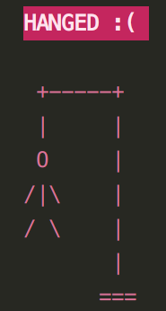

# 'Hangman' last chance

This is last work the end of learning programming language of python in [CodeAcademy](https://codeacademy.lt/programavimo-kursai/python-pradedantiesiems-uzimtiems-asmenims/) school.

***

## Introduction

### Rules

How to play hangman :dart:  
Hangman is a simple word guessing game. Player try to figure out an unknown  
word by guessing letters. If too many letters which do not appear in the word  
are guessed, the player is hanged (and loses).
<p align="center" width="100%">

</p>

As letters in the word are guessed, choose and write letter in terminal.  
If a letter not in the word is guess, you will see picture of a person on the  
gallows–one part for each incorrect letter guess. Most frequently, the person  
is drawn in 7 parts (for 7 letter guesses) in the order: gallows, head, body,  
left leg, right leg, left arm, right arm, rope.

***
# Terminal version
## Prepare to play

First clone a repository, it will be better if you create you own python environment.

```
git clone https://github.com/giedriuzz/Hangman_last_chance.git
```
Import all libs from `requirements.txt` or from `Pipfile.lock`  
#### If you use `pipenv` go to cloned directory and run.  
```
pipenv install
```
Activate virtual environment
```
pipenv shell
```
#### If you use `pip` go to cloned directory and run.  
```
pip install -r requirements.txt
```
### Terminal version without database
Terminal version dont need database, so you can run it without any other steps.  
Go to `/src` folder and run `app.py` file where is in.  
Game app don`t collect any data, so you can play without any worries.

```
python app.py
```

If you don`t have virtual environment just run

```
python3 app.py
```

## Add new Categories and Words

To edit or add new `Categories` and `words` you must edit `words.py` file where is in **`words`** folder.  

#### `words.py`

```python
words = {
    "Countries: [
        "AFGHANISTAN",
        "ALBANIA",
        "ALGERIA",
    ],
    "NEW_CATEGORY": [  
        "New_word_1",  
        "New_word_2"
        ]
```
### Terminal version with database

***

If want to play with database, you must have installed it. Run  `db_direct.py` file where is in `/src` folder.

If want add new `Categories` and `words` to database, you must edit `words.py` file where is in **`words`** folder. 
 ```
new_category = [
    ["NEW_CATEGORY"],
    ["NEW_WORD_1"],
    ["NEW_WORD_2"]
]

```
And need change imports in `db_direct.py` file, with new categories.
```
from words.words import (
    db_words_animals, 
    db_words_countries, 
    db_words_fruits, 
    new_category 
)
```

And change line in the end of file.

```
db_for_db = [
            db_words_animals,
            db_words_countries,
            db_words_fruits,
            new_category
        ]  # add here new category
```

<p align="left" width="100%">

</p>

`Ongoing work`
>> Game running in two **[Docker](https://www.docker.com)** containers. One container hold database an in other one Hangman application.  
